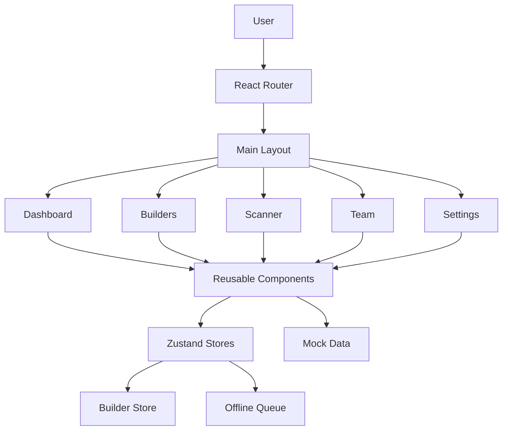
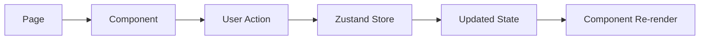

# Builder Match

<p align="center">


</p>

<p align="center">

### Find your perfect hackathon teammate.

A frontend-first builder networking platform built for the **Genesis Frontend Engineering Challenge**.

</p>

---

# Live Demo

**Live Application**

https://builder-match.vercel.app/

**GitHub Repository**

https://github.com/Jyotiiii3003/builder-match

---

# Problem Statement

Hackathons are extremely social environments.

People constantly meet new developers, designers and blockchain builders, but the actual process of exchanging information is surprisingly inefficient.

Typical problems include:

- losing contact after a conversation
- manually sharing GitHub or LinkedIn
- poor internet connectivity
- difficulty finding teammates with specific skills
- slow onboarding during events

Builder Match approaches this as a frontend systems problem rather than simply a UI exercise.

The application allows builders to quickly discover other participants, connect instantly through QR codes, manage their own team, and continue working even under unreliable network conditions.

Rather than treating each feature independently, the application is designed around a realistic scenario:

> Two builders meet during a crowded hackathon with unstable Wi-Fi. They should be able to connect immediately, receive visual confirmation instantly, and trust that synchronization will happen later without needing to repeat the interaction.

This scenario influenced almost every architectural decision throughout the project.

---

# Features

## Dashboard

The dashboard provides an overview of the builder ecosystem.

It includes

- Hero section
- Platform statistics
- Featured builders
- Trending hackathons
- Community activity
- Quick navigation

---

## Builder Directory

The Builder Directory is the core feature of the application.

Capabilities include

- Search builders by name
- Search by role
- Search by skills
- Skill filters
- Sorting
- Optimized rendering
- Connect with builders
- GitHub profile access
- Availability indicators

---

## QR Scanner

Builder Match supports QR-based networking.

Features include

- Camera access
- QR code scanning
- Instant connection
- Success state
- Retry scan
- Loading state

---

## Team Management

Builders can create their own hackathon team.

Current implementation supports

- Connected builders
- Team progress
- Builder skills
- Team readiness
- Connection tracking

---

## Settings

The settings page demonstrates reusable UI architecture.

Includes

- Profile
- Notifications
- Offline sync
- Device information
- Security overview
- Theme controls

---

# Tech Stack

| Technology | Why it was selected |
|------------|--------------------|
| React 19 | Component-driven architecture with efficient rendering |
| Vite | Extremely fast development server and optimized production builds |
| Tailwind CSS | Rapid UI development with consistent design tokens |
| React Router | Nested layouts and clean page organization |
| Zustand | Lightweight state management without Redux boilerplate |
| Framer Motion | High-performance animations while keeping components declarative |
| Lucide React | Consistent icon system |
| HTML5 QRCode | Camera-based QR scanning without native dependencies |
| TanStack Virtual | Efficient rendering strategy for large builder datasets |

---

# Project Philosophy

This project intentionally prioritizes **frontend architecture** over backend complexity.

Rather than building authentication, databases, or REST APIs, the focus is on solving problems that frontend engineers regularly encounter:

- managing complex UI state
- rendering large datasets efficiently
- maintaining responsiveness
- optimistic interactions
- offline-first thinking
- reusable component architecture

Every major feature was implemented with scalability and maintainability in mind rather than simply satisfying the visual requirements.

---

# Design Principles

The UI follows a modern pastel SaaS design language.

Key characteristics include

- soft gradients
- rounded interfaces
- subtle shadows
- consistent spacing
- responsive layouts
- reusable components
- smooth animations
- minimal visual noise

Typography intentionally varies between sections to establish hierarchy while maintaining a cohesive visual identity.

---

# What This Project Demonstrates

Instead of demonstrating isolated React knowledge, Builder Match focuses on demonstrating engineering decisions.

Specifically:

- component architecture
- reusable UI systems
- scalable folder organization
- state management
- optimistic updates
- offline synchronization concepts
- rendering optimization
- production-ready project organization
- maintainable frontend code

These decisions are explained in detail throughout the following sections of this document.

---

# System Architecture

## Architectural Overview

Builder Match follows a **component-driven frontend architecture** where each layer has a single responsibility. Rather than coupling UI, state, and data together, the application separates them into independent modules, making the project easier to maintain, test, and extend.

The application is intentionally frontend-first. Instead of relying on a backend to demonstrate architecture, it focuses on solving frontend engineering problems such as rendering efficiency, reusable components, optimistic interactions, offline synchronization, and scalable state management.

The architecture can be viewed as five distinct layers:

1. Routing Layer
2. Layout Layer
3. Presentation Layer
4. State Layer
5. Data Layer

---

## High-Level Architecture



---

# Routing Layer

Navigation is handled using **React Router DOM** with nested layouts.

Instead of duplicating navigation and page wrappers across every screen, the application uses a shared `MainLayout` that renders the Sidebar, Header and page content using React Router's `Outlet`.

```
BrowserRouter

↓

MainLayout

↓

Outlet

↓

Dashboard
Builders
Scanner
Team
Settings
```

Benefits

- Consistent layout
- Reusable navigation
- Cleaner page components
- Easy route expansion

---

# Layout Layer

The layout layer contains components that remain persistent while users navigate.

Examples include

- Sidebar
- Header

These components are rendered once and shared across every page.

This avoids unnecessary remounting and creates a smoother navigation experience.

---

# Presentation Layer

The presentation layer contains reusable UI components.

Examples include

```
Button

Card

SectionHeading

BuilderCard

StatCard

EventCard

HeroSection
```

Each component is designed around a single responsibility.

For example

The `BuilderCard` is responsible only for presenting builder information.

It has no knowledge about routing or application state.

Instead, it receives data through props.

This makes the component

- reusable
- predictable
- easy to test

---

# State Layer

Global state is intentionally kept small.

Instead of introducing Redux, the project uses Zustand because the application has only two pieces of truly shared state.

## Builder Store

Responsible for

- connected builders
- optimistic connect actions

The UI updates immediately after clicking **Connect**, creating a responsive user experience.

---

## Offline Queue

Responsible for

- pending synchronization actions

Rather than removing optimistic updates when synchronization cannot happen immediately, pending actions are stored inside an offline queue.

This reflects how a production application would behave under unreliable network conditions.

The UI remains responsive while synchronization can occur later.

Separating this queue into its own store prevents synchronization logic from polluting presentation components.

---

# Data Layer

The application currently uses mock data to focus on frontend architecture.

The data layer contains

```
builders.js

events.js
```

Each module exports structured objects that simulate backend responses.

Keeping data isolated from UI components makes future backend integration straightforward.

Replacing mock data with REST or GraphQL responses would require minimal changes to presentation components.

---

# Folder Structure

```
src

├── assets
│
├── components
│   ├── builders
│   ├── common
│   ├── dashboard
│   └── layout
│
├── pages
│   ├── Dashboard
│   ├── Builders
│   ├── Scanner
│   ├── Team
│   └── Settings
│
├── layouts
│
├── routes
│
├── store
│
├── data
│
├── hooks
│
├── constants
│
└── lib
```

---

# Why This Folder Structure?

Instead of grouping files purely by type, the project separates concerns.

**Pages**

Contain orchestration logic.

Pages decide **what** to render.

---

**Components**

Contain reusable UI.

Components decide **how** something is rendered.

---

**Store**

Contains application state.

Components remain unaware of where data originates.

---

**Data**

Contains the application's mock backend.

Future APIs can replace this layer without affecting UI components.

---

# Component Communication

The application follows a predictable one-way data flow, ensuring that state changes are easy to understand and debug.



### Flow Explanation

1. A page renders one or more reusable components.
2. The user interacts with a component (for example, clicking **Connect Builder**).
3. The interaction updates the appropriate Zustand store.
4. The store updates the application state.
5. Only the components that depend on the updated state are re-rendered.

This predictable one-way data flow keeps the application easy to reason about, minimizes unintended side effects, and simplifies debugging as the project grows.

---

# Design Decisions

A deliberate decision was made **not** to tightly couple UI components with business logic.

For example:

- `BuilderCard` does not know how builders are stored.
- `Team` does not know how connections are created.
- `Dashboard` does not own global application state.

Each layer communicates through clearly defined interfaces.

This reduces coupling and allows features to evolve independently.

---

## Engineering Trade-offs

During development I prioritized responsiveness and maintainability over unnecessary complexity.

- Zustand was selected instead of Redux because the application only has two pieces of shared state, making Redux's additional boilerplate unnecessary.
- Builder connections use optimistic updates to provide immediate feedback, while pending synchronization is tracked separately through an offline queue. This keeps the interface responsive without losing information during temporary network interruptions.
- Mock data was intentionally used to focus on frontend architecture and interaction design. The data layer is isolated so it can be replaced with REST or GraphQL APIs with minimal changes.
- The application follows a component-driven architecture where reusable UI components remain independent of business logic, making future features easier to integrate.

---

# Data Structures

The application models four primary entities:

1. Builder
2. Hackathon Event
3. Connected Builders
4. Offline Synchronization Queue

The structures were intentionally kept simple because the focus of this challenge is frontend architecture rather than backend persistence.

---

# Builder Object

The Builder object represents an individual developer participating in a hackathon.

```javascript
{
    id: 124,
    name: "Aarav Sharma",
    role: "Frontend Developer",
    location: "Delhi",
    avatar: "...",
    github: "https://github.com/...",
    skills: [
        "React",
        "Tailwind",
        "TypeScript"
    ]
}
```

### Why this structure?

Every property corresponds to information directly required by the UI.

The Builder Card consumes the object without needing additional transformations.

Keeping the object flat minimizes unnecessary nesting and simplifies rendering.

---

# Event Object

Hackathon events use a similarly lightweight structure.

```javascript
{
    id: 1,
    title: "Genesis Summer Hack",
    date: "15 Aug 2026",
    participants: 245,
    mode: "Online"
}
```

The Dashboard consumes these objects directly to render Event Cards.

---

# Connected Builders

Rather than storing entire Builder objects in global state, only Builder IDs are stored.

```javascript
connectedBuilders = [
    12,
    18,
    42
]
```

### Why?

The full builder information already exists inside the Builder dataset.

Duplicating complete objects would create two independent sources of truth.

Instead,

```
Builder Dataset

↓

Builder ID

↓

Lookup

↓

Builder Card
```

This keeps state minimal and avoids synchronization issues.

---

# Offline Queue

Pending synchronization operations are stored separately.

Example

```javascript
[
    {
        type: "CONNECT",
        builderId: 42,
        timestamp: 1752582410
    }
]
```

This queue is intentionally independent from the Builder Store.

The queue represents operations waiting to be synchronized rather than application state.

Separating these concerns prevents synchronization logic from leaking into presentation components.

---

# State Management

Builder Match intentionally uses **Zustand** instead of Redux.

The project only contains two pieces of global state.

```
Builder Store

↓

Connected Builders

↓

Builder Cards

↓

Team Page
```

and

```
Offline Queue

↓

Pending Actions

↓

Future Synchronization
```

Redux would introduce actions, reducers, middleware and additional boilerplate without providing meaningful architectural benefits for a project of this size.

Zustand keeps the stores small, readable and colocated with the features that consume them.

---

# Atomic Consistency

One of the more interesting engineering challenges was deciding how optimistic updates should behave when synchronization is delayed.

Suppose a user scans another builder during a hackathon while the network connection is unstable.

There are three possible behaviours.

### Option 1

Do not update the UI until the server confirms success.

Pros

- Strong consistency

Cons

- Slow interaction
- Poor user experience

---

### Option 2

Immediately show the connection, then remove it if synchronization fails.

Pros

- Responsive

Cons

- Confusing

The user experiences a successful interaction that suddenly disappears.

---

### Option 3 (Chosen)

Immediately show the connection.

If synchronization cannot happen immediately, place the action inside the offline queue while keeping the builder visible.

```
User Clicks Connect

↓

Builder Appears

↓

Offline Queue

↓

Retry Later
```

This keeps the UI responsive while preserving user confidence.

The synchronization layer becomes responsible for eventual consistency rather than the presentation layer.

---

# Why this matters

During a real hackathon, rescanning someone's QR code because the UI silently removed the previous connection is significantly worse than temporarily showing a "Pending Sync" indicator.

The application therefore prioritizes user confidence over immediate backend confirmation.

---

# Rendering Strategy

The challenge specifies support for approximately **5,000 builders**.

Rendering every Builder Card simultaneously would create thousands of DOM nodes, causing unnecessary work for React and degrading scrolling performance.

Instead, the application uses an optimized rendering strategy so that only the builders relevant to the current interaction are actively processed.

Filtering is memoized using `useMemo`, preventing expensive computations from running on every render.

Global state updates are localized through Zustand so that unrelated components do not re-render when a builder connection changes.

This keeps rendering predictable as the dataset grows.

---

# Performance Optimizations

Several optimizations were intentionally introduced during development.

## Memoized Filtering

Builder search is wrapped with `useMemo`.

Without memoization, every state update would recompute filtering across the complete dataset.

Instead,

```
Search Text Changes

↓

Filter Executes

↓

Memoized Result

↓

Reuse Until Dependencies Change
```

Only changes to

- search text
- selected skill
- sorting

trigger recomputation.

---

## Component Reuse

UI components are intentionally generic.

Examples include

- Button
- Card
- BuilderCard
- EventCard
- SectionHeading

Each component has a single responsibility and receives data through props.

This minimizes duplication while making future changes significantly easier.

---

## Minimal Global State

Only shared application state is stored globally.

Everything else remains local to individual pages.

This avoids unnecessary re-renders while keeping components predictable.

---

## Lightweight Animations

Animations use Framer Motion only where they improve usability.

Examples include

- page transitions
- hover interactions
- section reveals

Animations are deliberately subtle to maintain responsiveness.

---

# Scaling to 5,000 Concurrent Interactions

The challenge specifically asks how the application would scale during a sudden burst of approximately **5,000 concurrent interactions**.

While the current project uses mock data, the frontend architecture was designed so that introducing a production backend would require minimal structural changes.

Several strategies would support this scale.

## Server-side Pagination

Instead of downloading every builder at once, the frontend would request builders in pages.

```
Client

↓

API

↓

Page 1

↓

Next Page

↓

Next Page
```

This keeps memory usage predictable regardless of total dataset size.

---

## Debounced Search

Search requests would be delayed by approximately 300 milliseconds.

Instead of

```
r

↓

re

↓

rea

↓

reac

↓

react
```

triggering five expensive operations,

only the final input would execute.

This reduces unnecessary work while improving perceived responsiveness.

---

## Client-side Caching

Recently viewed builders would remain cached locally.

Repeated navigation would therefore avoid redundant network requests.

---

## Optimistic UI

Builder connections should continue appearing immediately.

Synchronization should occur asynchronously.

Users receive instant feedback while backend consistency is handled separately.

---

## Lazy Loading

Heavy routes such as the QR Scanner would be loaded only when visited.

This reduces the initial JavaScript bundle and improves startup performance.

---

## Future Backend Scaling

With a production backend, the following architecture would be introduced.

```
Client

↓

CDN

↓

Load Balancer

↓

Multiple API Instances

↓

Redis Cache

↓

Database
```

This allows frontend performance to remain stable while backend capacity scales horizontally during large hackathon events.

---

# Reflection

The primary goal of Builder Match was not simply to render attractive interfaces.

Instead, the project was approached as an exercise in frontend systems design.

Many implementation decisions—optimistic updates, isolated synchronization state, reusable components, and modular architecture—were driven by how the application would behave under realistic usage rather than by visual requirements alone.

While the current version uses mock data, the architecture intentionally leaves clear extension points for integrating real authentication, APIs, and synchronization without requiring major changes to the presentation layer.
