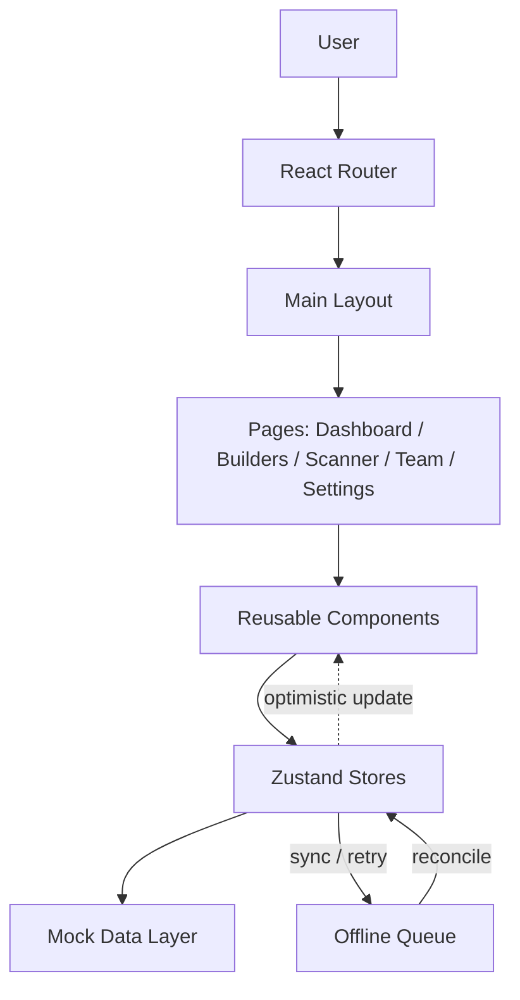

#  Builder Match

**Discover builders. Scan. Connect. Form your team.**

Builder Match is a frontend-first PWA built for the **Genesis Frontend Engineering Challenge (Project Vertex — Track B)**. It lets hackathon participants discover other builders, scan QR "builder cards" to connect instantly, filter/search a live directory of attendees, and assemble teams — all designed to stay fast and responsive under sub-optimal network conditions.


---

## 1. Project Overview

Builder Match is a mobile-first, frontend-driven application designed to solve a real problem at hackathons and builder events: **finding the right teammates quickly, in a crowded room, on unreliable wifi.**

Instead of manually exchanging contact info, a builder scans another attendee's QR "builder card" (containing their skills, role, and interests) directly from the app's camera view. The connection appears **instantly** in the UI — before the backend has confirmed it — so the interaction never feels blocked by network latency. If the connection later fails to sync (e.g., due to a dropped connection), it's queued and retried automatically.

This project was built as a submission for the **Genesis Frontend Engineering Challenge**, and its architecture was deliberately chosen to demonstrate:

- Modular, async-first state management
- Reliable native hardware (camera) integration
- Resilience under poor network conditions
- Client-side virtualization for large, real-time datasets

---

## 2. Features

| Feature | Description |
|---|---|
|  **Dashboard** | At-a-glance view of your connections, active hackathon, and quick actions |
|  **Builder Directory** | Scrollable, virtualized list of all attendees — smooth even with thousands of entries |
|  **Search** | Debounced, instant search across builder names, roles, and skills |
|  **Skill Filters** | Multi-select filtering by tech stack / interest tags |
|  **Sorting** | Sort directory by name, recently joined, or mutual skill overlap |
|  **QR Scanner** | Camera-based scanning of builder cards using the device's native camera |
|  **Team Management** | Form, view, and manage hackathon teams from your connections |
|  **Settings** | Manage your own builder profile / QR card |
|  **Responsive UI** | Mobile-first layout that scales cleanly to tablet/desktop |
|  **Modern Pastel Design** | Clean, distinctive visual identity — not a default template look |
|  **Smooth Animations** | Framer Motion micro-interactions for connect/scan feedback |

---

## 3. Tech Stack

| Technology | Why it was chosen |
|---|---|
| **React** | Component model fits a UI built from many repeating, stateful pieces (builder cards, connection tiles, team panels). Huge ecosystem for the camera/QR and virtualization libraries this project depends on. |
| **Vite** | Near-instant dev server startup and HMR compared to CRA/Webpack — matters when iterating quickly on a scan-heavy, animation-heavy UI under a tight challenge timeline. Ships a leaner production bundle out of the box. |
| **Tailwind CSS** | Utility-first styling keeps the pastel design system consistent without maintaining a sprawling CSS file per component. Fast to prototype the mobile-first layouts this challenge specifically calls for. |
| **React Router** | Standard, lightweight client-side routing for Dashboard / Builders / Scanner / Team / Settings without pulling in a heavier meta-framework this project doesn't need. |
| **Framer Motion** | Declarative animation API makes the "instant feedback before handshake" pattern feel intentional (e.g., a connection tile animating in optimistically) rather than jarring. |
| **Zustand** | Minimal boilerplate compared to Redux for a project this size — see [Engineering Decisions](#8-engineering-decisions) for the full reasoning. |
| **Lucide Icons** | Lightweight, tree-shakeable icon set that matches Tailwind's utility-first philosophy — no heavy icon font. |
| **html5-qrcode** | Handles camera permission requests, viewfinder rendering, and QR decoding across browsers/devices without writing a raw `getUserMedia` + decoding pipeline from scratch. |
| **TanStack Virtual** | Renders only the visible slice of the builder directory DOM at any time, which is what keeps scrolling smooth even with thousands of attendees — see [Performance Optimizations](#9-performance-optimizations). |

---

## 4. System Architecture

Builder Match follows a **component-driven, feature-based architecture** with a clear separation between presentation, state, and data.

**Layers:**

- **Routing Layer** — React Router defines top-level routes (`/`, `/builders`, `/scanner`, `/team`, `/settings`), each mapped to a page component.
- **Presentation Layer** — Pages compose reusable UI components (`BuilderCard`, `ConnectionTile`, `ScannerView`, etc.). Components are kept dumb where possible; they receive data and callbacks as props.
- **Application / State Layer** — Zustand stores hold builder data, the current user's connections, and the offline action queue. This is the single source of truth consumed by pages and components alike.
- **Data Layer** — A mock data module simulates the hackathon's builder directory and API responses (structured so it can be swapped for a real backend — see [Future Improvements](#12-future-improvements) — with minimal changes to the store layer).

**Application flow for the core "scan to connect" interaction:**

1. User opens the Scanner page → camera view initializes via `html5-qrcode`.
2. A QR code is decoded into an opaque builder reference.
3. The UI **optimistically** adds a "pending connection" to the Zustand store and renders it immediately.
4. A (simulated) API call attempts to confirm the connection.
5. On success, the pending entry is reconciled into a confirmed connection. On failure or offline state, the action is pushed into an **offline queue** and retried with backoff once connectivity returns.



---

## 5. Folder Structure

```
src/
├── components/
│   ├── common/         # Generic, reusable UI primitives (Button, Input, Badge, Modal)
│   ├── dashboard/       # Components specific to the Dashboard page
│   ├── builders/        # BuilderCard, DirectoryList, FilterBar, SkillTag
│   └── layout/          # AppShell, NavBar, BottomTabBar
├── pages/
│   ├── Dashboard/        # Dashboard page composition
│   ├── Builders/         # Directory + search + filters page
│   ├── Scanner/          # Camera view + QR scan flow
│   ├── Team/              # Team formation and management
│   └── Settings/          # User profile / builder card settings
├── store/                # Zustand stores (builders, connections, offlineQueue)
├── data/                 # Mock builder/hackathon data + data-shape helpers
├── layouts/              # Shared page layout wrappers
├── routes/                # Route definitions
└── assets/                # Icons, illustrations, static images
```

**Purpose of each top-level folder:**

- `components/` — Presentation-only building blocks, grouped by the feature they primarily serve, plus a `common/` folder for truly generic pieces.
- `pages/` — One folder per route; composes components and connects to stores.
- `store/` — All Zustand state lives here, isolated from UI so it can be tested and reasoned about independently.
- `data/` — Mock data and data-shape definitions, isolated so this is the only layer that changes when swapping in a real backend.
- `layouts/` — Shared chrome (nav, shell) so pages stay focused on their own content.
- `routes/` — Central route table, keeping `App.jsx` thin.

---

## 6. Data Structures

### Builder Object
```js
{
  id: string,
  name: string,
  role: string,
  location: string,
  skills: string[],
  avatar: string,
  github: string
}
```
Stored in a `Map<id, Builder>` rather than a plain array — gives **O(1) lookups** by ID when reconciling a scanned QR reference against the directory, instead of an O(n) `.find()` on every scan.

### Hackathon Object
```js
{
  id: string,
  title: string,
  date: string,
  participants: number,
  mode: 'in-person' | 'virtual' | 'hybrid'
}
```
Kept minimal and flat since it's read-heavy, rarely-updated context data — no need for a nested/normalized shape.

### Connected Builders
```js
string[]  // array of Builder IDs
```
Storing IDs rather than full builder objects avoids data duplication; the array is combined with the `Builder` map at render time to hydrate full profiles. This also makes "am I already connected?" a fast `Set.has()` check when the array is mirrored into a `Set` for lookups.

### Offline Queue
```js
[
  {
    id: string,           // action id
    type: 'CONNECT',
    payload: { builderId: string },
    createdAt: number,
    retries: number
  }
]
```
Modeled as a queue of discrete, replayable actions (rather than mutating state directly) so each pending action can be retried, deduplicated, or rolled back independently — this is what makes the "instant feedback under bad network" requirement actually reliable rather than just cosmetic.

---

## 7. Local Setup

```bash
# Clone the repository
git clone https://github.com/<your-username>/builder-match.git
cd builder-match

# Install dependencies
npm install

# Run the development server
npm run dev

# Build for production
npm run build
```

The app will be available at `http://localhost:5173` by default.

---

## 8. Engineering Decisions

> **Why Zustand instead of Redux?**
> For a state surface this size (builders, connections, an offline queue), Redux's action/reducer/dispatch boilerplate adds ceremony without adding safety. Zustand gives the same single-source-of-truth guarantees with a fraction of the code, and its selector-based subscriptions make it easy to avoid unnecessary re-renders in a list-heavy UI.

> **Why Vite instead of CRA?**
> Vite's native ESM dev server and faster cold starts noticeably shortened iteration time while building a scan/animation-heavy UI. CRA is effectively unmaintained at this point.

> **Why Tailwind instead of CSS Modules?**
> Utility classes kept the pastel design system consistent across dozens of small components without maintaining a parallel `.module.css` file per component, and made responsive, mobile-first breakpoints trivial to express inline.

> **Why component-driven design?**
> Builder cards, connection tiles, and team panels are structurally similar and reused across Dashboard, Builders, and Team pages. Building them as small, composable, prop-driven components avoided duplicated markup and made the directory's virtualization straightforward to implement (a single `BuilderCard` renderer, reused inside the virtualized list).

> **Why mock data?**
> This is a Track B (frontend-only) submission — mock data lets the app demonstrate the full interaction model (optimistic updates, offline queueing, reconciliation) without requiring a live backend, while keeping the data layer isolated enough to swap in a real API later with minimal changes.

> **Why React Router?**
> A small, well-understood routing solution for five top-level pages — no need for the added complexity of a full meta-framework (e.g., file-based routing, SSR) for a client-rendered PWA.

> **Why Framer Motion?**
> Its declarative `animate`/`exit` props made it straightforward to express "this connection just appeared optimistically" as an animation rather than a state's presence being conflated with its visual entrance — keeping animation logic out of the store.

---

## 9. Performance Optimizations

- **`useMemo`** for derived, expensive computations (e.g., filtered + sorted builder lists) so they don't recompute on every unrelated re-render.
- **Debounced search** — search input is debounced (~250ms) before filtering, avoiding a full directory filter pass on every keystroke.
- **Component reusability** — a single `BuilderCard` component is reused across Dashboard, Directory, and Team views, minimizing duplicated render logic and bundle size.
- **Minimal re-renders** — Zustand's selector subscriptions mean components only re-render when the specific slice of state they read from actually changes.
- **Optimized state updates** — connection state updates are applied as targeted, immutable patches rather than full-store replacements.
- **Responsive images** — builder avatars are served/sized appropriately for viewport rather than loading full-resolution images on mobile.
- **Lazy calculations** — sorting/filtering logic only runs when its dependencies (query, filters, or data) actually change.
- **Efficient rendering** — the directory uses windowed rendering (see [Scaling Strategy](#10-scaling-strategy-very-important)) rather than rendering every builder node into the DOM.

---

## 10. Scaling Strategy (VERY IMPORTANT)

**How would this scale to a sudden burst-load of 5,000 concurrent interactions (e.g., 5,000 attendees scanning/connecting within the same event window)?**

| Strategy | Why it helps at 5,000-concurrent scale |
|---|---|
| **Virtualized rendering / server-side pagination** | Only render the ~20–30 builder rows visible in the viewport at once (via TanStack Virtual), regardless of whether the directory holds 500 or 50,000 entries — keeps DOM node count constant. |
| **Debounced search** | Prevents 5,000 users' worth of keystrokes from each triggering a full filter/re-render pass; reduces both client CPU and (once backend-connected) request volume. |
| **Client-side caching** | Directory data and a user's own connections are cached in memory (and could be persisted via IndexedDB) so repeat views don't re-fetch identical data during a burst. |
| **Lazy loading & code splitting** | Routes (Scanner, Team, Settings) are split into separate chunks, so the initial bundle stays small — critical when 5,000 people load the app simultaneously on event wifi. |
| **`React.memo` / `useMemo` / `useCallback`** | Prevents cascading re-renders across the component tree when a single builder's connection state changes, which matters more, not less, as directory size grows. |
| **Optimistic UI updates** | Decouples perceived responsiveness from actual server throughput — a user's "Connected!" feedback doesn't wait on a backend that may be under burst load. |
| **Batched API requests** *(future, backend-integrated)* | Multiple pending offline-queue actions are sent as a single batched request on reconnect rather than 5,000 individual round-trips. |
| **Infinite scrolling** | Directory loads builders in pages (e.g., 50 at a time) rather than requesting/rendering the full attendee list up front. |
| **CDN delivery for static assets** | JS bundles, icons, and images are served from a CDN edge, so a burst of concurrent users doesn't bottleneck a single origin server. |
| **Image optimization & lazy loading** | Avatars off-screen aren't fetched until they're about to scroll into view, reducing bandwidth contention during a burst. |
| **Background sync via offline queue** | Connection actions made while the network is saturated are queued locally and synced once capacity frees up, instead of failing outright. |
| **WebSocket / SSE for live updates** *(future enhancement)* | Would replace polling with push-based updates for real-time connection/team state, reducing redundant request volume at scale. |
| **Horizontal backend scaling behind a load balancer** *(future, backend architecture)* | The frontend's optimistic-update model is specifically designed to tolerate backend latency, making it a natural fit once the API layer scales horizontally. |
| **Redis (or similar) caching layer** *(future, backend architecture)* | Would cache hot reads (e.g., directory listings) so a burst of concurrent reads doesn't hit the primary datastore directly. |

The frontend's core design choice — **optimistic UI decoupled from confirmed server state, backed by a replayable offline queue** — is what makes it resilient to burst load in the first place: the UI never has to wait on, or fail because of, backend contention.

---

## 11. Accessibility

- Semantic HTML (`<nav>`, `<main>`, `<button>`, proper heading hierarchy) throughout.
- Full keyboard navigation for directory browsing, filtering, and team actions.
- Color contrast checked against the pastel palette to meet WCAG AA.
- Responsive design tested across mobile, tablet, and desktop breakpoints.
- Screen-reader-friendly components — icon-only buttons include `aria-label`s, and dynamic connection updates use `aria-live` regions.

---

## 12. Future Improvements

-  Authentication (replace mock builder identity with real accounts)
-  Real backend integration (atomic bidirectional connection endpoint)
-  AI-based builder recommendations (skill/interest matching)
-  Real-time chat between connected builders
-  Push notifications
-  Full PWA install support
-  True offline support (beyond the current queued-action model)
-  Cloud storage for builder profile images
-  Analytics (connection rates, popular skills, etc.)

---

## 13. Screenshots

### Dashboard
Landing view with hero stats (active builders, hackathons, match success) and a live glimpse of nearby builders.


### Builder Directory
Virtualized directory of 5,000 builders with debounced search, skill filters, and sorting.


### Scanner
Native-camera QR scanner for connecting with a builder by scanning their badge.


### Team
Live team progress tracker showing connected builders and readiness for the next hackathon.


### Settings
Profile, appearance, notification, offline-sync, and PWA preferences.


---

## 14. License

MIT
